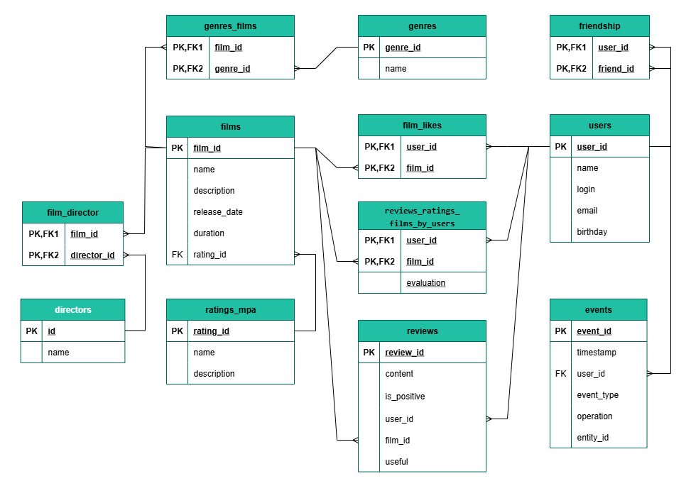

## Диаграмма базы данных


### Пояснения к диаграмме
- Таблица `users` хранит информацию о пользователях приложения.
- Таблица `films` содержит данные о фильмах.
- Таблица `friendship` реализует 
двунаправленную связь «друзья» между пользователями и представляет собой:
  - Одна запись `(user_id, friend_id)` означает, что пользователь отправил заявку в друзья — дружба не подтверждена.
  - Вторая запись `(friend_id, user_id)` появляется при подтверждении заявки — дружба становится взаимной.
  - Таким образом, одна запись = заявка в ожидании, две записи = подтверждённая дружба. Связь - «многие ко многим».
- Таблица `film_likes` связывает пользователей и фильмы, позволяя пользователям ставить лайки фильмам. Каждая запись отражает факт, что пользователь user_id поставил лайк фильму film_id. Связь - «многие ко многим»
- `films.rating_id` — внешний ключ на таблицу `ratings_mpa`, где хранится рейтинг фильма (MPA, PG, R и т.п.).
- Таблица `genres` — справочник жанров (комедия, драма, фантастика и т.д.).
- Таблица `genres_films` — связующая таблица для реализации связи «многие ко многим» между фильмами и жанрами.
___

## Примеры SQL-запросов для основных операций Filmorate

- ### Получить пользователя по ID
```
SELECT * 
FROM users 
WHERE user_id = 1;
```
- ### Получение всех пользователей
```
SELECT * 
FROM users;
```
- ### Получить фильм по ID
```
SELECT * 
FROM films 
WHERE film_id = 1;
```
- ### Получение всех фильмов
```
SELECT * 
FROM films;
```
- ### Получить 10 популярных фильмов (в соответствии с количеством лайков)
```
SELECT f.film_id, f.name, COUNT(fl.user_id) AS likes_count
FROM films AS f
LEFT JOIN film_likes AS fl ON f.film_id = fl.film_id
GROUP BY f.film_id, f.name
ORDER BY likes_count DESC
LIMIT 10;
```
- ### Получить список фильмов с жанром комедия и рейтингом PG
```
SELECT f.*
FROM films AS f
INNER JOIN genres_film AS fg ON f.film_id = fg.film_id
INNER JOIN genres AS g ON fg.genre_id = g.genre_id
INNER JOIN ratings_ak AS r ON f.rating_id = r.rating_id
WHERE g.name = 'Комедия' AND r.name = 'PG';
```
___
# Конец :japanese_goblin: :vampire_man:
